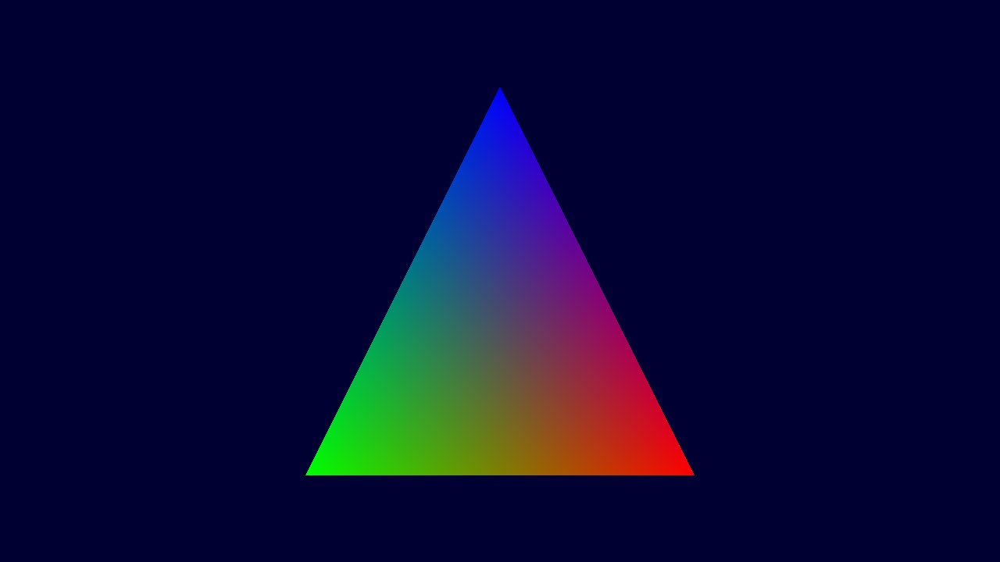

# games106 

现代图形绘制流水线原理与实践，作业框架。

这个fork来自[SaschaWillems/Vulkan: Examples and demos for the new Vulkan API (github.com)](https://github.com/SaschaWillems/Vulkan) 在这个项目中有非常多的example可以学习。在学习一个API的时候，代码示例永远是最好的老师。本课程的作业需要在已有的代码示例中做修改。

## Build

详情可以查看项目原来的 [BUILD文档](./BUILD.md) ，可以在Windows/Linux/Andorid/macOS/iOS中构建

## HomeWork

作业的课程代码在./homework目录下，shader在./data/homework/shaders下。上传作业也按照一样的文件结构。上传对应的文件即可。

### 作业提交

课程学生注册方法：登录 [http://cn.ces-alpha.org/course/register/GAMES106/](http://cn.ces-alpha.org/course/register/GAMES106/) 注册账号，填写个人信息，输入验证码ilovegraphics，即可进入课程主页，查看并提交作业

### homework0

作业0，作为一个熟悉编译环境的课程作业。最后显示一个如下图一样的三角形。有兴趣可以尝试在Android或者iOS上运行



### homework1

作业1，扩展GLTF loading。作业1提供了一个gltf显示的demo，只支持静态模型，以及颜色贴图。作业1需要在这个基础上进行升级。
#### 作业提交

按照代码框架的目录（方便助教检查和运行代码），把修改的文件打包成zip，或者用git patch的方式提交作业代码。

#### 作业要求
1. 作业要求的gltf文件已经上传到了data/buster_drone/busterDrone.gltf
2. 支持gltf的骨骼动画。
3. 支持gltf的PBR的材质，包括法线贴图。
4. 必须在homework1的基础上做修改，提交其他框架的代码算作不合格。
5. 进阶作业：增加一个Tone Mapping的后处理pass。增加GLTF的滤镜功能。tonemap选择ACES实现如下。这个实现必须通过额外增加一个renderpass的方式实现。
```c++
// tonemap 所使用的函数
float3 Tonemap_ACES(const float3 c) {
    // Narkowicz 2015, "ACES Filmic Tone Mapping Curve"
    // const float a = 2.51;
    // const float b = 0.03;
    // const float c = 2.43;
    // const float d = 0.59;
    // const float e = 0.14;
    // return saturate((x*(a*x+b))/(x*(c*x+d)+e));

    //ACES RRT/ODT curve fit courtesy of Stephen Hill
	float3 a = c * (c + 0.0245786) - 0.000090537;
	float3 b = c * (0.983729 * c + 0.4329510) + 0.238081;
	return a / b;
}
```

直接运行会不成功缺少GLTF模型。以及字体文件。根据[文档](./data/README.md)下载 [https://vulkan.gpuinfo.org/downloads/vulkan_asset_pack_gltf.zip](https://vulkan.gpuinfo.org/downloads/vulkan_asset_pack_gltf.zip) 并且解压到./data文件夹中

下面是相关的资料

- GLTF格式文档 [https://github.com/KhronosGroup/glTF](https://github.com/KhronosGroup/glTF)
- 带动画的GLTF模型已经上传到了目录data/buster_drone/busterDrone.gltf。这个gltf文件来自于 [https://github.com/GPUOpen-LibrariesAndSDKs/Cauldron-Media/tree/v1.0.4/buster_drone](https://github.com/GPUOpen-LibrariesAndSDKs/Cauldron-Media/tree/v1.0.4/buster_drone)
  - Buster Drone by LaVADraGoN, published under a Attribution-NonCommercial 4.0 International (CC BY-NC 4.0) license
  - 作者存放在sketchfab上展示的页面 [https://sketchfab.com/3d-models/buster-drone-294e79652f494130ad2ab00a13fdbafd](https://sketchfab.com/3d-models/buster-drone-294e79652f494130ad2ab00a13fdbafd)
- 完成这个作业需要额外学习的内容，都可以在作业框架下找到示例代码用于学习和参照（example code 是学习一个api最好的老师🙂）
  - 骨骼动画在这个工程下有可以学习的样例 examples/gltfskinning/gltfskinning.cpp
  - PBR材质 
    - 直接光照 examples/pbrbasic/pbrbasic.cpp 
    - 环境光照 examples/pbribl/pbribl.cpp

### homework2
扩展 homework/homework2 (来自examples/variablerateshading) 中的示例，使得shading rate 可以根据绘制结果本身得频率动态调整，从而在不影响整体绘制质量的前提下，减少着色率。
可以阅读并参考 “Visually Lossless Content and Motion Adaptive Shading in Games” 中的描述，完成
1. Content Adaptive Variable Shading Rate
2. Motion Adaptive Variable Shading Rate

reference论文在: [data/Visually Lossless Content and Motion Adaptive Shading in Games.pdf](./data/Visually%20Lossless%20Content%20and%20Motion%20Adaptive%20Shading%20in%20Games.pdf)

### homework3
homework3 比较独立，作业的框架代码以及作业要求：[GAMES106-HW5](https://github.com/Chaphlagical/GAMES106-HW5)

### homework4
扩展 homework/homework4 (来自example/texturecubemap) 中的示例。
作业要求：
1. 修改函数```void loadCubemap(std::string filename, VkFormat format, bool forceLinearTiling)```。示例中的```textures/cubemap_yokohama_rgba.ktx```是一张RGBA8的ktx图，使用任意平台支持的压缩格式压缩，比如BC7，ASTC，或者ETC2等等之类的压缩格式。把这张RGBA格式的图片压缩成压缩纹理。